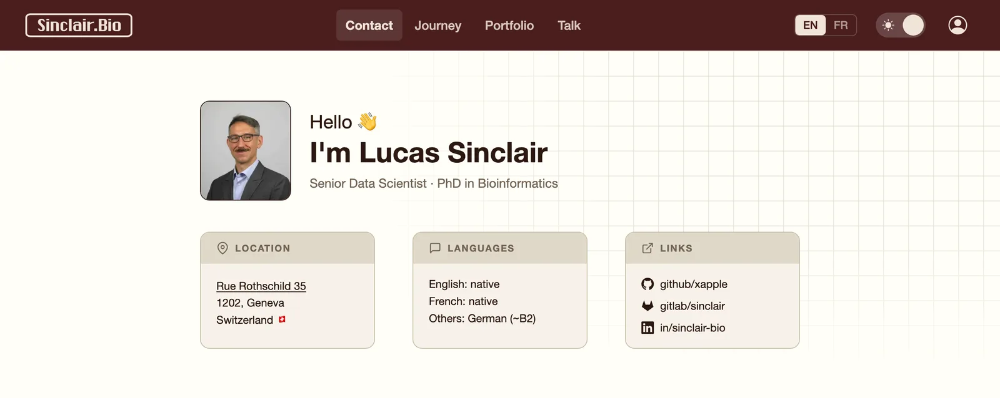

# `sinclair.bio` version 1.0.2

This is the website at `https://sinclair.bio`.

It is made with the following build technology: [Astro](https://docs.astro.build).

### Screenshot

---

---

### Running locally

This project uses [Node.js](https://nodejs.org) (22 or newer) and the
[pnpm](https://pnpm.io) package manager. On macOS, install both with
[Homebrew](https://brew.sh):

    $ brew install node pnpm

Then, from the root of the repository, install the node dependencies:

    $ pnpm install

And finally launch the development server:

    $ pnpm dev

The site will be live at <http://localhost:4321>, with hot-reloading on file changes.

Other useful commands:

| Command        | Action                                          |
|----------------|-------------------------------------------------|
| `pnpm build`   | Type-check and build the static site to `dist/` |
| `pnpm preview` | Serve the production build locally              |
| `pnpm check`   | Run the Astro/TypeScript type-checker           |

### Deploying to Cloudflare Pages

Hosting is **provisioned as code** with [OpenTofu](https://opentofu.org): the
config in [`tofu/`](tofu/) creates the git-connected Cloudflare Pages project,
attaches the `sinclair.bio` custom domain, creates the apex DNS record, and
301-redirects `www` to the apex. See [`tofu/README.md`](tofu/README.md) for
the prerequisites (API token, one-time  GitHub authorization) and the
`tofu init` / `plan` / `apply` workflow.

Once provisioned, Cloudflare builds and deploys automatically on every push to
`main` — build command `pnpm build`, output `dist/`, `NODE_VERSION=22`. It also
auto-detects `functions/` at the repo root with no extra config, so
`functions/index.ts` intercepts `/` and 302-redirects to `/en/` or `/fr/` based
on the visitor's `Accept-Language` header.

### Testing

To run the tests suite, you will need [uv](https://docs.astral.sh/uv), which
fetches Python and the test dependencies for you. The tests live in the `tests/`
directory and use [pytest](https://docs.pytest.org). Run the suite from the
root of the repository:

    $ uv run --with pytest pytest tests/

### TODO

Maybe add the Cloudflare Web Analytics snippet since it's cookieless.